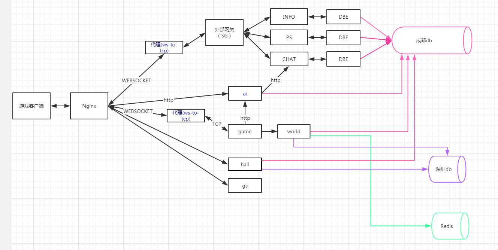

# h5捕鱼部署

## 发布预发布
依赖

H5捕鱼重构版上预发布流程
```
个人奖池 
	配置中心 personpool 添加预发布配置 personpool_10087.txt
	更新服务 

hallservice 
	配置中心 预发布更新配置 hall.json
	镜像版本: repo.qianz.com/middle-end/hallservice:master-v1.0.2

gate 
	预发布更新服务

游戏服 
	配置中心 预发布更新配置 更机器相关的配置
		discovery.txt // 要使用预发布的配置
		http.txt // 默认docker内HTTP端口8000
		websocket.txt  // 默认docker内webscoket端口3000
		game_conf.txt  ["ChatURL"] = "127.0.0.1:17995",   // 聊天服配置
	重点关注  discovery.txt 和 聊天服配置,内网，预发布、线上不一致

	镜像版本: repo.qianz.com/qpgame/h5by:master-v1.0.1
	新起机器部署 	
```

## 内网压测
压测人数240，线上最终单进程160人
http://172.13.12.42:3000/d/CT2ShEfWz/you-xi-jian-kong?orgId=1&var-datasource=Prometheus&var-job=h5by-game&var-instance=All&var-http_method=All&var-http_user=All&var-http_client_method=All&var-comet_caller=All&from=now-12h&to=now


## 发布到线上
内网压测 http://172.13.12.42:3000/d/CT2ShEfWz/you-xi-jian-kong?orgId=1&var-datasource=Prometheus&var-job=h5by-game&var-instance=All&var-http_method=All&var-http_user=All&var-http_client_method=All&var-comet_caller=All&from=now-12h&to=now

H5捕鱼重构版上线流程

第一步.更新中台服务
	个人奖池 
		配置中心 personpool 添加配置 personpool_10087.txt
		更新服务 
	hallservice 
		配置中心 更新配置 hall.json
		镜像版本: repo.qianz.com/middle-end/hallservice:master-v1.0.3
	gate 
		更新服务
	worldservie
		配置中心 添加游戏
第二步.部署游戏服
	配置中心 确认机器相关配置信息是否正确
	镜像版本: repo.qianz.com/qpgame/h5by:master-v1.0.5
	新起机器部署服务器，配置游戏监控、日志上报日志中心 

第三步.测试
	客户端(使用预发布资源服)，修改配置及映射连接线上服进行测试

第四步.客户端资源更新对外
	更新捕鱼大厅资源 (修改:跳转游戏链接增加token、loginway参数)
	更新游戏客户端桌面版和手游版本资源


## 部署
部署图


h5捕鱼新增了两种类型的进程，`ws-to-tcp`和`ai`.

`ai`进程是用来匹配调度陪玩机器人的。它是一个http服务器，它为游戏进程和客户端提供http服务，并且会请求老框架聊天服转发消息给陪玩机器人客户端。

`ws-to-tcp`是一个websocket转发tcp的代理进程，用于桥接 websocket类型的客户端和tcp类型的服务器。它的启动参数如下
```
参数列表
-id 代理进程标识 string类型，用于区分生成不同的日志文件名
-ws websocket服务器地址
-tcp 后台tcp服务器地址
-split 粘包拆包长度，支持2个字节和4个字节，默认2个字节
-max 最大连接数限制 默认1000
-binary 是否使用二进制数据格式(2个字节长度进行粘包、拆包)，默认为文本格式(以'\n'进行粘包拆包)
-loglevel log日志级别 panic fatal error warn info debug,默认 info
-logpath  日志路径 默认 ./log/

启动示例
ws-to-tcp -id "ws-to-tcp-gate-1-1" -ws ":4223" -tcp "0.0.0.0:5000" -split 2 -max 500 -binary=true -logpath="./log/" -loglevel="info"
```
对于 ws-to-tcp的使用，它可以是一个多对一的类型，即可以开多个代理进程代理一个后端tcp服务器进程，如
```
ws-to-tcp -id "ws-to-tcp-gate-1-1" -ws ":4223" -tcp "0.0.0.0:5000" -split 2 -max 500 -binary=true -logpath="./log/" -loglevel="info"
ws-to-tcp -id "ws-to-tcp-gate-1-2" -ws ":4224" -tcp "0.0.0.0:5000" -split 2 -max 500 -binary=true -logpath="./log/" -loglevel="info"
```

在h5游戏中，一个游戏进程(总负载建议上限不超过200人)配置一个ws-to-tcp代理进程即可，老框架的外部网关的代理进程建议配置2个以上(单个代理假定500人负载)

一个游戏服务器进程配置示例，比如一个游戏服务器进程tcp端口10211，对外websocket端口10210，`res/url.json`配置文件如下，
```
			"Games": [{
				"ServerId": "1",
				"RoomId": 1,
				"Http": "0.0.0.0:9211",
				"NignxTcp": "127.0.0.1:10210",
				"Tcp": "0.0.0.0:10211"
			}
```
然后
```
ws-to-tcp -id "ws-to-tcp-game-1-1" -ws ":10212" -tcp "0.0.0.0:10211" -split 2 -binary=true -logpath="./log/" -loglevel="info"
```


## 发布


## 线上两台机ftp（查看日志使用）
```
182.140.226.20：52121 账号：readlog 密码：b7b62x6M（H5捕鱼）                
182.140.226.21：52121 账号：readlog 密码：b7b62x6M（H5捕鱼） 


182.140.212.166:52121 账号：readlog 密码：Rn6pQPVXJb
```
推荐使用FileZilla客户端工具进行访问。

## 发布

## 中台监控
jinzhentao jinzhentao  http://182.140.226.38:3000/


主要关注几个点：
1.税收
2.各个鱼的返还
3.单个玩家赢分有没有异常

