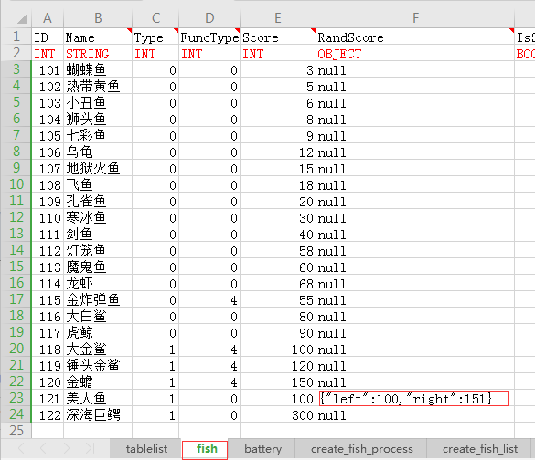
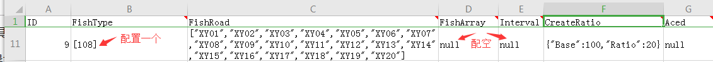
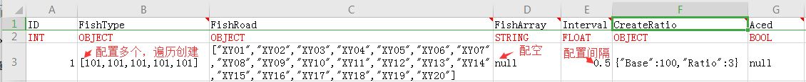
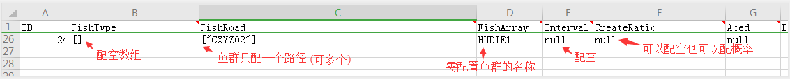
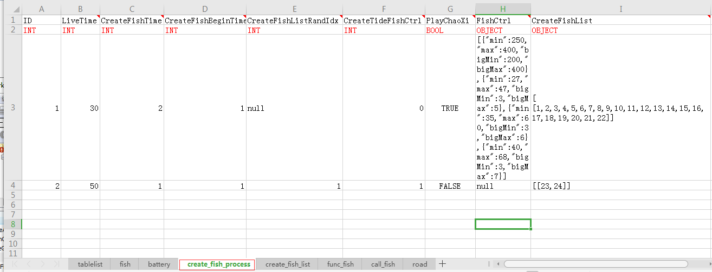

# 简介
本篇文章主要用来介绍如何配置捕鱼游戏配置。

## 关注点
- 有哪些配置文件
- 配置文件讲解
- 配置中心

## 配置结构
捕鱼的配置在 config 目录下:
```
├── main.lua  入口脚本，主要用来引入其它lua脚本，重载所有脚本
├── Config.lua 游戏内通用的配置
├── TipsConfig.lua 公告配置
├── ChargeGiven.lua 充值暗送配置
├── WeChatGiven.lua 微信新用户暗送配置
├── GivenCard.lua 暗送刮刮卡配置
├── ErrorMsgConf.lua 游戏内错误消息提示配置
├── FishConfig.lua 鱼属性配置
├── CreateFishConfig.lua 产鱼配置
├── CreateFishMgr.lua 鱼管理配置
├── FunctionFishConf.lua 功能鱼配置
├── CallFishConf.lua 召唤鱼配置
├── FreeGunConf.lua 免费炮配置
├── PropsConfig.lua 游戏内道具配置
├── UserPool.lua 用户抽奖配置
├── AwardPoolConfA.lua 奖池配置
├── AwardPoolConfB.lua 奖池配置
├── BalanceAlarmConf.lua 游戏内小玩法收支报警配置
```


## 测试
水电费

- 双方都
阿斯蒂芬

- 阿斯蒂芬

## 产鱼配置

### **配置导出工具介绍**
excel2json.exe 是一个可以将符合配置规则的excel表导出json、lua配置文件，工具的源码和使用请看[https://git.huoys.com/jinzht/excel2json](https://git.huoys.com/jinzht/excel2json)

通常我们使用它时，只需配置好excel表，然后点击 convert.bat,就可以导出配置到client，server目录下，然后执行copy.bat就会拷贝到客户端和服务器工程配置路径下.

### **捕鱼游戏配置原则**
捕鱼游戏客户端是使用的json配置文件，而服务器使用的是lua配置文件.

其中一些客户端和服务器共用的配置都提取到了excel表进行配置,然后进行执行convert.bat和copy.bat就可以拷贝到各自项目工程目录下。

其中一部分是需要直接到客户端项目工程目录下修改json配置文件或者到服务器工程目录下修改lua配置文件，它们通常都是不常发生变化的配置。

也有部分需在捕鱼编辑器上配置然后下载到Configuration目录下的client和server目录,然后执行copy.bat统一拷贝到各自项目工程目录下。比如
```
fishArrPathC.json fishPath.json fish_path_pov.json 要手动拷贝到Configuration\client目录下
FishArray.lua 要手动拷贝到Configuration\server目录下
```

为了更方便调试、验证，游戏运行过程中热加载配置能带来很大的便捷性。服务器需在Config.lua中给LoadFileTime配置一个较短的时间间隔，比如60秒，这样修改配置后，无需重启服务器，60s之内就可以重载配置，按新的配置运行了；客户端则需要在cocos creator中重新运行游戏。

作为一个配置者，原则上除非极端情况，是不需要关注客户端和服务器工程下的配置的，只需要关注鱼编辑器及Configuration目录，一切的配置都是从Configuration目录进行导出并拷贝到客户端和服务器工程下的。


### **出鱼配置**
捕鱼游戏鱼的创建全部是由服务器来控制，客户端收到创建消息后进行创建显示。

#### **鱼的属性配置**
对应配置表(fish) ，它的核心属性包括
```
ID 鱼种类id，也可以叫鱼的类型
Name 鱼的名称
Type 是小鱼还是大鱼种类  0:小鱼 1:大鱼, 这个主要作用是用来限制同屏鱼数量(create_fish_process标签页FishCtrl列) 
FuncType 是哪一种功能鱼 0:普通鱼1:掉落鱼2:升级鱼3:闪电鱼4:奖金鱼5:转盘鱼  服务器会根据不同的种类做不同的逻辑处理
Score 鱼固定分值，赔率
RandScore 随机分值区间 如果是成长鱼以鱼阶段分为准, 不需要此属性配置为 null 即可
```



#### **鱼的创建规则配置**
鱼的创建有很多创建属性的，比如可以创建单条鱼，一组鱼，随机不同的路径，一组鱼的鱼与鱼之间是有相对偏移坐标的，也可以一组鱼之间相互穿插，鱼与鱼之间设定创建间隔，概率创建等等属性。

按照这个原则，我们将一组创建属性作为一个创建规则(excel表中一行记录),所以抽象出了创建规则表(create_fish_list),这个表主要有以下属性
```
ID 规则编号，由场景出鱼阶段索引使用
FishType 一组鱼的id，创建单条鱼和线性鱼时会遍历数组中的id进行创建，如果是创建鱼群则配置空数组 []
FishRoad 一组路径名，服务器从中随机一条路径
FishArray 鱼群的名称，非鱼群配置值 null, 鱼群则配置 鱼群的名称
Interval 相对上一条鱼的创建时间间隔，目前仅线性鱼进行配置，其它类型配置 null
CreateRatio 创建概率，即服务器根据规则编号进行创建时，会按此处概率决定是否创建，配置null表示一定创建
Aced 是否是召回鱼创建类型  除了是召唤鱼配置 TRUE 其它配置 null
```

进行分类之后，我归为了三类，创建单条鱼，创建线性鱼，创建鱼群.

单条鱼



线性鱼



线性鱼是创建多条鱼，多条鱼的路径一样，但是鱼与与之间存在时间间隔(Interval),服务器会遍历FishType中多个鱼id，按照Interval间隔进行创建.

鱼群



鱼群也是创建一组鱼，一组鱼共用同一条路径，但是鱼与鱼之间存在固定相对坐标偏移(由编辑器生成鱼群配置)，服务器会遍历鱼群配置文件(FishArray.lua)指定鱼群名称对应的所有鱼，客户端取鱼群配置文件(fishArrPathC.json)按相对坐标进行创建。

#### **场景出鱼控制配置**
之前讲了鱼属性配置和创建规则配置，现在来讲出鱼控制配置，对应create_fish_process标签页。

```
ID 场景id，也叫做阶段id
LiveTime 场景持续时长
CreateFishTime 每个多久添加鱼儿，执行 一组 规则创建(是一组不是一个规则)
CreateFishBeginTime 切换场景后多久开始出鱼，过度场景使用
CreateFishListRandIdx 是否随机Center_Fish_List中的一组进行创建,null和TRUE表示不随机，TRUE表示随机
CreateTideFishCtrl 当前场景允许创建几组 规则创建,null表示无限制
PlayChaoXi 场景结束后是否播放 放潮汐特效
FishCtrl 本阶段按桌子人数控制产鱼数量,它有4组数据，分别代表1个、2个、3个、4个玩家时各自的限制属性
CreateFishList 创建鱼规则数组 列表，每组可以是多个创建规则，可以配置N组
```


可以看到实际的配置中只有两行记录，第一行是配置的普通场景，第二行是潮汐场景，服务器会在这两个场景间循环切换，并创建鱼。

在配置数据层面罗列一下他们他们的差别

```
1.潮汐场景持续时长要比普通场景短(LiveTime)
2.普通场景只配置一组创建规则，而且里面的规则基本上是 单条鱼、线性鱼、鱼群(一般配少量的小鱼群)
  潮汐场景通常配置多组创建规则，每组里面必须配置多个创建规则，且创建规则只能是鱼群(CreateRatio也要配null)，可以理解为鱼阵就是多组鱼群的组合
3.普通场景 不限制创建组数，但限制小鱼和大鱼数量
  普通场景 限制创建组数，但不限制小鱼和大鱼数量
```


## 常用配置

## 刮刮卡

## 个人奖池

## 暗送

##  道具


## 其它配置


## 本地配置与配置中心
